# Udacity Project: Investigate a Dataset

## Nanodegree: Data Analyst

## Title: Research About Health Data in Gapminder Database

### Table of Contents

<li><a href="#objective">Objective</a></li>
<li><a href="#data_description">Data Description</a></li>
<li><a href="#data_meaning">Data Meaning</a></li>
<li><a href="#data_wrangling">Data Wrangling</a></li>
<li><a href="#eda">Exploratory Data Analysis</a></li>
    <ul>
    <li><a href="#q1">Question 1: What Is The Influence Of The Ratio Private/Total Health Expenditure In The Life Expectancy And In The Cancer Treatments Success?</a></li>
    <li><a href="#q2">Question 2: Compare The Increments In Total Health Spending Between 1995 and 2010 With The Increments In The Life Expectancy And Healing Cancer Ratios During These Years.</a></li>
    <li><a href="#q3">Question 3: Relationship Between The Cancer Types And The Region Of The World Or The HDI (Human Development Index).</a></li>
    </ul>
<li><a href="#conclusions">Conclusions</a></li>
    <ul>
    <li><a href="#c1">Conclusion 1</a></li>
    <li><a href="#c2">Conclusion 2</a></li>
    <li><a href="#c3">Conclusion 3</a></li>
    </ul>

## Objective

In this project we have analized some of the data collected on the web site http://www.gapminder.org/data/. On this page we can find a lot of information referred to many countries (economical, social, geographical, etc), but we have focused in some data related with health. Expecifically, we have estudied the data related with health expenditures (public and private), life expectancy, and the data gathered about some cancer types.

## Data Description:

You can see all the `csv`files downloaded in the `\data` directory. Almost all of the have the same structure:

- A column **country** that is used as index and each **year** is represented in another a column in the dataframe.

- The data is savad for achr **contry** and each ** year as **float64**.

- **year and country**, are both as strings.

- The meaning of the data is indicated in the name of the file.

## Data Meaning:

This is the description of the values according to the **gapminder** page.

    
- **year:** The year in which the values were taken.

- **country:** The country for each value.

- **hdi:** Human development index. Is an index used to rank the countries by level of 'human development'. It contains
    three dimnensions: health level, educational level, and living standard.

- **life_expectancy:** The average number of years a newborn child would live if current mortality patterns were to stay the     same.

- **gov_health_spend:** The average health expenditure per person that has been paid by gobernment entities, expressed in US     dollars using the exchange rate.

- **total_health_spend:** The average health expenditure per person, expressed in US dollars using the average exchange         rate.

- **private_health_spend:** Private share of health expenditure (%). Percentage of total health expenditure that has been       paid by private entities, for exampel commercial insurance and out-of-pocket payments.

- **breast_cancer_deaths_w, cervical_cancer_deaths_w, colonandrectum_cancer_deaths_w, liver_cancer_deaths_w, lung_cancer_deaths_w, stomach_cancer_deaths_w, colonandrectum_cancer_deaths_m, liver_cancer_deaths_m, lung_cancer_deaths_m, prostate_cancer_deaths_m, stomach_cancer_deaths_m:** Number of deaths due to each type of cancer in 100,000 male or female residents during the certain year. This rate is calculated as if each country has the same age composition as the world population.

- **breast_cancer_new_cases_w, cervical_cancer_new_cases_w, colonandrectum_cancer_new_cases_w, liver_cancer_new_cases_w, lung_cancer_new_cases_w, stomach_cancer_new_cases_w, colonandrectum_cancer_new_cases_m, liver_cancer_new_cases_m, lung_cancer_new_cases_m, prostate_cancer_new_cases_m, stomach_cancer_new_cases_m:** Number new cases due to each type of cancer in 100,000 male or female residents during the certain year. This rate is calculated as if each country has the same age composition as the world population.

**regions** description: This file is a little different:

- The **country** column acts as the index of the dataframe. It has also four more columns dividing the countries in regions:

- **four_regions:** ['africa', 'americas', 'asia', 'europe']

- **six_regions:** ['middle_east_north_africa', 'sub_saharan_africa', 'america',
       'south_asia', 'europe_central_asia', 'east_asia_pacific']
       
- **eight_regions:** ['africa_north', 'africa_sub_saharan', 'america_north',
       'america_south', 'asia_west', 'east_asia_pacific', 'europe_east',
       'europe_west']
  
- **nine_regions:** ['africa_north', 'africa_sub_saharan', 'america_central',
       'america_north', 'america_south', 'asia_west', 'east_asia_pacific',
       'europe_east', 'europe_west']

## Data Wrangling

* **Load the Files into Dataframes:**

We load all the neccesary files in a set of dataframes.

* **Merging The Data:**

In this part all the dataframes will be merged in a sigle dataframe called `df_global` with a column for the country, a column for the year, another one for the region and different columns for the values. 

* **Adding New Columns:**

It adds some additional columns calculated from the original data. For example we calculate the private health expenditure per person in US dollars using the percent value in private_health_spend_pc column. It also adds columns with the totals of cancer deaths and cases, summing the corresponding columns.

* **This the final `df_global` dataframe we have obtained:**

      <class 'pandas.core.frame.DataFrame'>
      Int64Index: 41098 entries, 0 to 41097
      Data columns (total 42 columns):
      country                              41098 non-null object
      year                                 41095 non-null object
      hdi                                  4862 non-null float64
      life_expectancy                      40437 non-null float64
      gov_health_spend                     3040 non-null float64
      total_health_spend                   3008 non-null float64
      private_health_spend_pc              3040 non-null float64
      breast_cancer_deaths_w               6729 non-null float64
      cervical_cancer_deaths_w             6722 non-null float64
      colonandrectum_cancer_deaths_w       6189 non-null float64
      liver_cancer_deaths_w                5493 non-null float64
      lung_cancer_deaths_w                 6698 non-null float64
      stomach_cancer_deaths_w              6686 non-null float64
      colonandrectum_cancer_deaths_m       6204 non-null float64
      liver_cancer_deaths_m                5488 non-null float64
      lung_cancer_deaths_m                 6713 non-null float64
      prostate_cancer_deaths_m             6724 non-null float64
      stomach_cancer_deaths_m              6657 non-null float64
      breast_cancer_new_cases_w            5326 non-null float64
      cervical_cancer_new_cases_w          5326 non-null float64
      colonandrectum_cancer_new_cases_w    5326 non-null float64
      liver_cancer_new_cases_w             5322 non-null float64
      lung_cancer_new_cases_w              5326 non-null float64
      stomach_cancer_new_cases_w           5326 non-null float64
      colonandrectum_cancer_new_cases_m    5326 non-null float64
      liver_cancer_new_cases_m             5325 non-null float64
      lung_cancer_new_cases_m              5326 non-null float64
      prostate_cancer_new_cases_m          5326 non-null float64
      stomach_cancer_new_cases_m           6657 non-null float64
      four_regions                         41098 non-null object
      eight_regions                        41098 non-null object
      six_regions                          41098 non-null object
      nine_regions                         41098 non-null object
      private_health_spend                 3008 non-null float64
      total_cancer_men_death               41098 non-null float64
      total_cancer_women_death             41098 non-null float64
      total_cancer_men_cases               41098 non-null float64
      total_cancer_women_cases             41098 non-null float64
      total_cancer_cases                   41098 non-null float64
      total_cancer_death                   41098 non-null float64
      total_cancer_heal                    41098 non-null float64
      total_cancer_heal_pc                 6859 non-null float64
      dtypes: float64(36), object(6)
      memory usage: 13.5+ MB

* **We have defined also three auxiliary dataframes from `df_global` to answer the questions:**

**df_health1:** It was used to investigate differences between countries regarding the relationship between the public and private health investments in order to see their effects in the success of health caring. The first year we have health spending data is 1995, and the last is 2010. So we are going to make analisys and comparissons between this two years. 
      This Datafrme will have the next columns:
      
        - year 
        - country 
        - nine_regions 
        - life_expectancy
        - total_cancer_heal_pc
        - total_health_spend 
        - gov_health_spend 
        - private_health_spend 
        - private_health_spend_pc
        
We saw some countries that didn't have some data in health spending for this years, so I decided to do a backfill and a forwardfill of this values.
        
We decided also to drop six other countries that didn't have any health spending data at all.  

We have dropped also six other counties without life expectancy data.

**df_health2:** It was another dataframe with the columns `year`, `country`, `hdi`, `nine_regions` and `all the the columns related with cancer deaths`. In this case have compared the years 1995 and 2015 because they are the oldest and the most recent years for which almost of the countries have data.

We dropped againg from this dataframe three countries without data about cancer deaths.

We deleted also the countries without data about the `hdi`.

We did also backfill on the `hdi` data to extend this value to 1995 in some other countries.

**df_health3:** Is is a reestructured version of the `df_health2`. We want to have all the cancer types in a sigle column. In the question 3 we want to show the correlation between the hdi and the different cancer causes in a matrix of graphs. To do that we need a categorical column with the type of cancer and another column with the values, instead of one column for each type of cancer.

## Exploratory Data Analysis

Before starting to answer the questions we have draw a plot showing how the life expectancy has growth in the years per region:

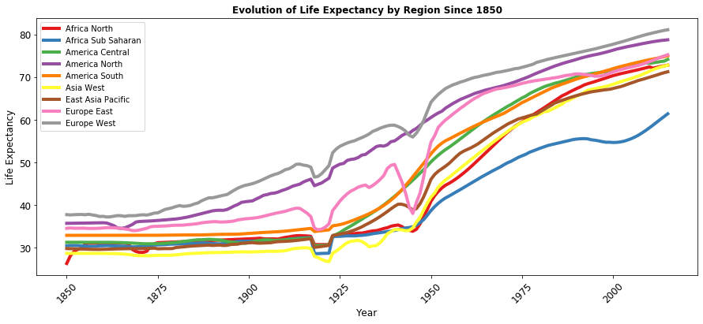
  
We can see in this picture that, since 1850, the life expectancy have experimented a great growth. We can easily apreciate the decrements during the two world wars period also. In the first case they must have been very relevant also the effects of the called 'spanish flu' or the 1929 Crash, because North America suffered also a big decrement in the life expectancy, and I don't think that the First World War were so relevent in the life expectancy of this region.

### Question 1: What Is The Influence Of The Ratio Private/Total Health Expenditure In The Life Expectancy And In The Cancer Treatments Success?

In this first question we explored the differences between the public and private health investments. We are interested in knowing how relevant are they in reaching a high life expectancy and in the succeess of the treatments against cancer. Are more successful those countries with a higher public spending or those with a higher private health spending?

To make this aproach we have started depicting a graph with the percentage of the private health spending over the total spending based in the years of life expectancy. In the x-axis the countries have been divided by life expectancy years in four quartiles. The first quartile represents the countries with smallest life expectancy and the last quartile corresponds with the countries with a highest number of years. We have used the dataframe df_health1 filtered for the year 2010.

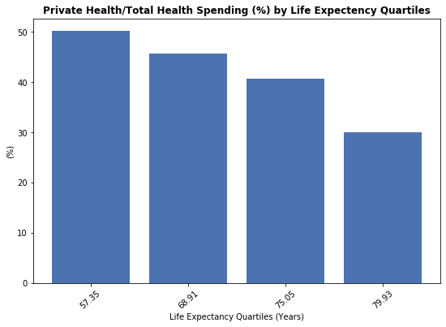

We can see that the ratio is smaller for the countries with a higher life expectancy. In these countries, with almost 80 years of life expectancy, the private health represents the 30% of the total health spending, while in the first quartile represents the 50%

We have done a similar analysis for the rate of deaths in the total cases of cancer:

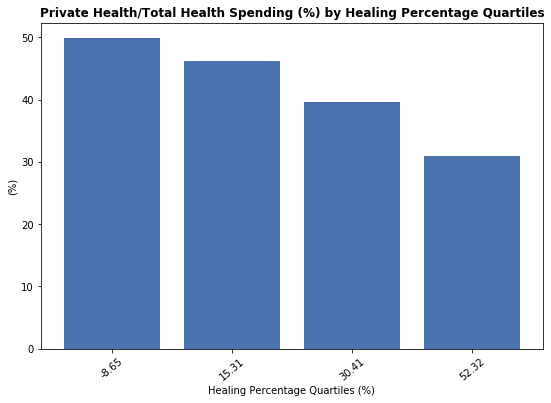

We can see again that the ratio private/total (%) is smaller in those countries with a higher percentage of healing success.
In the first quartile the healing percentage is negative. I don't know the reason because I don't know exactly the source of the data. In those countries the lack of means of detection of cancer probably can influence also in the data reported. 

Finally we have drawn a comparative histogram to see the distribution of the countries over the ratio private/health spending(%) for two groups of countries: those that have a life expectancy greater than 75 years and those which life expectancy is smaller than that:

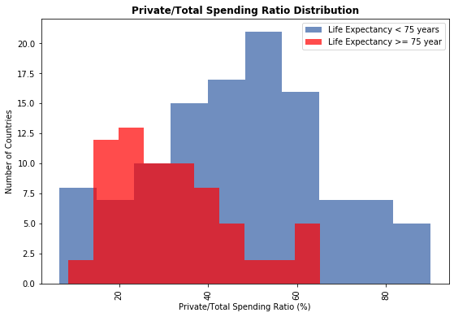

### Question 2: Compare The Increments In Total Health Spending Between 1995 and 2010 With The Increments In The Life Expectancy And Healing Cancer Ratios During These Years.

This question is related to the previous one, but in this case we want to put the focus in the total health spending and its growth between 1995 and 2010 for each region. We also want to compare this increment with the achievements in terms of reaching a higher life expectancy and a cancer healing rates increments. The analisys was made dividing the world in nine regions.

Finally we have tried to estimate how much it costs to increase a year in the life expectancy acording the current life expectancy. Or, which is the same, how much costs, in mean, to increase the life expectancy from 55 years to 56, from 65 to 66, 75 to 76, etc.

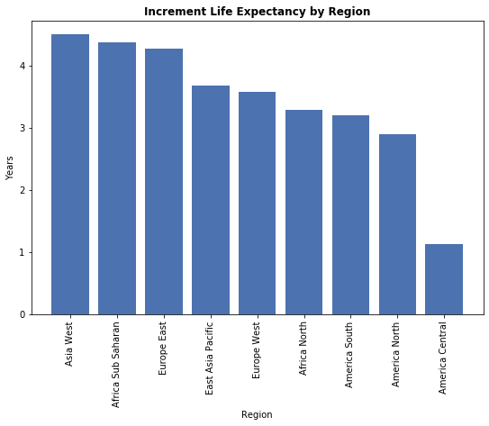

The region of the world with a highest increment in the life expectancy is West Asia wiht 3.97 years, while Central America only has had an increment of 2.54 years between 1995 and 2010.

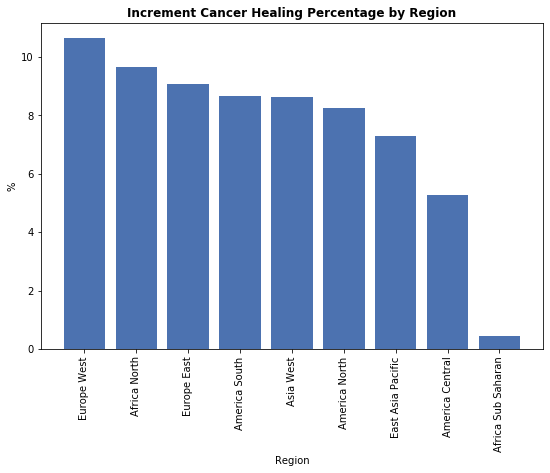

In terms of cancer healing rates the Subsaharian Africa have had a very low increment, whereas East Europe has increased this rate more than a 10%.

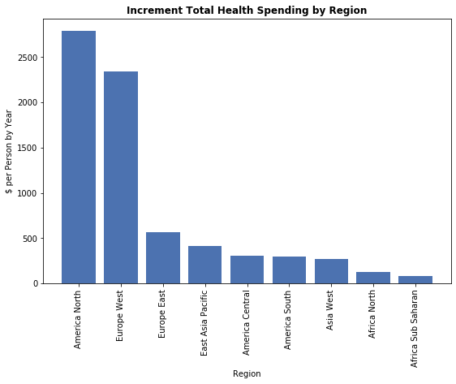

North America and West Europe are by far the two regions which have increased more their spendings.

Finally, we would like to estimate how much needs to increase its health investment a country in relation with its life expectancy to increase a year. To do this we have divided the increment in the health spending by the number of years of increment in the life expectancy between the year 1995 and 2010. We have grouped also the countries by their life expectancy in 1995 in bins of five years. At the end we have caluclated the mean of spending by year for each group of contries. This is the result drawed in a graph:

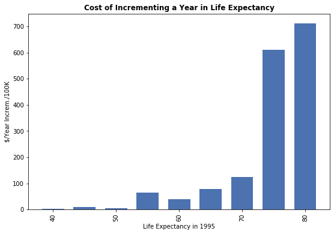

This graph shows that around 75 years the investments in health care of the countries per incremented year are much bigger that for the countries with lower life expectancy. This is expectable taking into account that these countries are closer to the limit and they are usually the richest ones.

### Question 3: Relationship Between The Cancer Types And The Region Of The World Or The HDI (Human Development Index).

In this part we were interested in knowing if there were some correlation between the HDI or the region of the world and the different cancer types.

To analyze this we have started researching which is the most usual cause of cancer death in each region or in each group of HDI. The calculations were made for 1995 and 2015. This allowed us to find out any difference between regions and to see if there has been any change along the time.

We have started with the analysis by the Human Development Index (HDI). We have separated the countries in quartiles again by the HDI. Then, it was calculated the mean of deaths in each quartile for each type of cancer. We select the causes with more deaths in each quartile and it is showed in a dataframe and in a bar plot. The analisys will be made for both years.

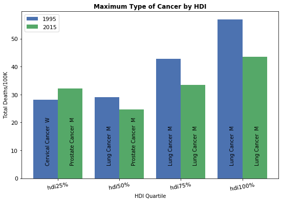

In all the countries with high development index, the lung cancer in men seems to be the more usual and there has not been changes in the last years, except a decrement in the number of deaths by 100K people.

On the other hand, in the low developed countries, the principal cause of cancer in 2015 seems to be the prostate cancer. And some years ago the most usual cause of death in the lowest developed countries was the Cervical Cancer in womans.

Then we have done a similar analysis, but by regions of the world instead of HDI. 

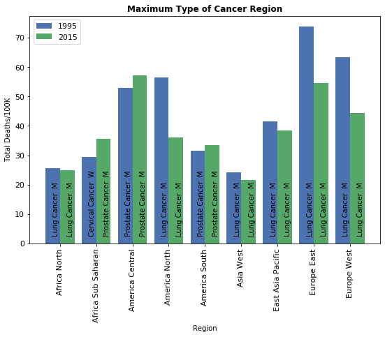

We can see here that lung cancer in men is the most frequent cause of death cancer in almost all the regions, except in South America, Central America and Subsaharian Africa. In the last case, in 1995, is where the cervical cancer was predominant.

It seems obvious that some of the types tend to be more usual in more developed areas, while others increment its prevalence with the lowest developing indexes.

To be more accurate we have studied the correlation between each cancer type and the HDI:

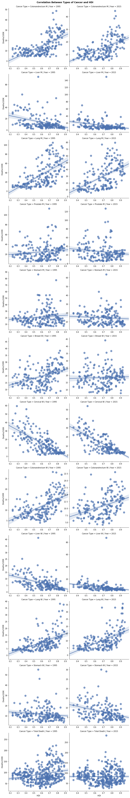

In this graph we can see tha the correlation between the total cancer deaths and the hdi is almost 0 in 2015, but this is not the case if we analize each cause separately. Some types, as colon-rectum and lung cancer, are much more frequent in developed countries, whereas the cervical cancer has a correlation of -0.74 in 2015, so it is clearly a bigger problem in the underdeveloped countries.

## Conclusions

### Conclusion 1:

From this analisys we can conclude that those countries with a greater life expectancy and with better results in cancer treatments tend, in general, to priorize the public health investments over the private investments. Whereas those countries with a high percentage of private health spending ususally have poorer results, probably because the total spending is very low in most of the cases. Anyway it seems that the responsability of achieve the higher marks in terms of health care belongs to the public investments, at least for the majority of the countries with the best results.

The best rate between private and total spending seems to be between 20% and 30%.

### Conclusion 2:

We have seen here that Nort America and West Europe are the two regions that have increased more, by far, the total spending in health care between the years 1995 and 2010. And though their results have not been bad, they don't have experimented the greatest increments in the life expectancy or cancer treatment success . Probably because they already had high health standards before.

On the other hand, Subsaharian Africa had a very low increment in the health costs by person, but they have experimented a big increment in the life expectancy. But they don't have so good results in terms of cancer healing percentage, which continue to be very low.

Anyway I have doubts about the cancer data collected in the Subsaharian Africa, they probably are incomplete and they don't reflect all the actual cases. 

| nine_regions       | Life Expectancy Inc | Total Cancer Heal Pc Inc | Total Health Spend Inc |
|--------------------|---------------------|--------------------------|------------------------|
| Africa North       | 3.28                | 9.65                     | 128.72                 |
| Africa Sub Saharan | 4.37                | 0.44                     | 77.29                  |
| America Central    | 1.13                | 5.27                     | 304.46                 |
| America North      | 2.90               | 8.26                     | 2786.00                |
| America South      | 3.20                | 8.66                     | 298.87                 |
| Asia West          | 4.50                | 8.61                     | 266.18                 |
| East Asia Pacific  | 3.68                | 7.30                     | 410.52                 |
| Europe East        | 4.28                | 9.06                     | 567.35                 |
| Europe West        | 3.59                | 10.63                    | 2342.71                |

Finally we have seen that, until 70 years, to increase a year in the life expectancy costs around 100 dollars per person or less, but above the 70 years the costs suffer a considerably increment, up to 600 dollars or 700 dollars per person.

### Conclusion 3:

In this part we have found out that not all the types of cancer are so usual in all regions of the planet. In general, the lung cancer in men is the most frecuent type of cancer in almost all regions, but in Subsaharian Africa, Central America and South America, the prostate cancer seems to be the most frequent. We also have seen that, in the case os Subsaharian Africa, the cervical cancer was the most common in 1995.

We have also discovered that there is a correlation between some types of cancer and the human develpment index. In some types the number of deaths tends to increase with the HDI: as in the colon-rectum and lung cancer, while in other cases tends to be lower: as in prostate and cervical cancer. In these cases the correlations is quite strong, which means that colon-rectum and lung cancer have more incidence in higher developed countries while prostate and lung cancer are a bigger problem in the coutries with lower development.

There are also some types of cancer that have not almost correlation.

This can be due to the access to the cancer treatments and to the life expectancy, because some types of cancer are more usual at advanced ages.

I attach again the table with the correlation index between the hdi and each tipe of cancer:

|           .                     | Correlation 1995 | Correlation 2015 |
|--------------------------------|------------------|------------------|
| Colonandrectum Cancer Deaths M | 0.623            | 0.566            |
| Liver Cancer Deaths M          | -0.373           | -0.301           |
| Lung Cancer Deaths M           | 0.605            | 0.533            |
| Prostate Cancer Deaths M       | 0.127            | -0.153           |
| Stomach Cancer Deaths M        | 0.118            | -0.081           |
| Breast Cancer Deaths W         | 0.370            | 0.045            |
| Cervical Cancer Deaths W       | -0.699           | -0.744           |
| Colonandrectum Cancer Deaths W | 0.534           | 0.401            |
| Liver Cancer Deaths W          | -0.464           | -0.311           |
| Lung Cancer Deaths W           | 0.527            | 0.556            |
| Stomach Cancer Deaths W        | -0.128           | -0.348           |
| Total Cancer Women Death       | -0.132           | -0.301           |
| Total Cancer Men Death         | 0.462            | 0.172            |

And this is the table with the most usual type of cancer death in each region:

| Nine Regions       | Max Deaths 1995 | Max Cancer Case 1995 | Max Deaths 2015 | Max Cancer Case 2015 |
|--------------------|-----------------|----------------------|-----------------|----------------------|
| Africa North       | 25.69           | Lung Cancer M        | 25.00           | Lung Cancer M        |
| Africa Sub Saharan | 29.30           | Cervical Cancer W    | 35.67           | Prostate Cancer M    |
| America Central    | 52.90           | Prostate Cancer M    | 57.16           | Prostate Cancer M    |
| America North      | 56.40           | Lung Cancer M        | 36.03           | Lung Cancer M        |
| America South      | 31.50           | Prostate Cancer M    | 33.48           | Prostate Cancer M    |
| Asia West          | 24.30           | Lung Cancer M        | 21.70           | Lung Cancer M        |
| East Asia Pacific  | 41.63           | Lung Cancer M        | 38.36           | Lung Cancer M        |
| Europe East        | 73.73           | Lung Cancer M        | 54.68           | Lung Cancer M        |
| Europe West        | 63.43           | Lung Cancer M        | 44.31           | Lung Cancer M        |

